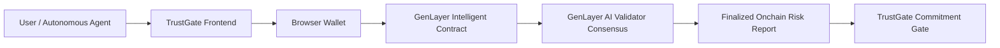

# TrustGate

> **Before an Agent Says Yes.**

TrustGate is a working hackathon prototype for pre-commitment risk inspection in agent-to-agent transactions. GenLayer can adjudicate when agents disagree; TrustGate asks GenLayer whether an agent should agree in the first place.

TrustGate sits between receiving a proposed deal and committing to it. It structures the complete commitment, submits it for AI-validator review, and returns a finalized onchain Risk Report before the user or agent decides to accept, renegotiate, or reject.

## The Problem

Agent-to-agent deals can combine ordinary-looking tasks with ambiguous obligations, excessive authority, weak evidence, unsafe payments, or instructions that conflict with the user's interests. Conventional smart contracts verify deterministic state transitions, but cannot alone judge whether a natural-language commitment is reasonable, adequately evidenced, or safe to accept.

## The Solution

TrustGate inspects six parts of a proposed deal:

- Task
- Contract Terms
- Requested Permissions
- Payment Conditions
- Evidence Requirements
- Instructions / Attached Content

It produces an overall risk level, detected issues, supporting evidence, potential consequences, confidence and unknowns, recommended actions, safer constraints, revised terms, and a recommendation such as `ACCEPT`, `RENEGOTIATE`, or `REJECT`.

## How TrustGate Works

1. A deal package is received or entered manually.
2. TrustGate structures the complete commitment.
3. A connected browser wallet submits it to the deployed GenLayer Intelligent Contract.
4. GenLayer AI validators independently inspect the deal.
5. Consensus completes and a structured Risk Report is finalized onchain.
6. TrustGate retrieves and validates the report for the exact inspection ID.
7. The user or agent chooses **Accept**, **Renegotiate**, or **Reject**.

Renegotiation produces a **TrustGate Counterproposal**. It does not silently modify the counterparty's agreement and is never automatically accepted. Safer proposed terms are loaded into the editable package for review or further editing. The user must explicitly submit a new inspection, and GenLayer independently judges the revised deal.

## Why GenLayer

TrustGate requires judgment over natural-language scope, contractual risk, permission proportionality, evidence quality, and potentially malicious or conflicting instructions. These questions are subjective rather than simple deterministic checks.

The GenLayer Intelligent Contract uses AI validator consensus to evaluate those questions and stores the resulting report in durable onchain state.

## Architecture



The header includes a [PROJECT THESIS](https://x.com/eam__sha/status/2094519952233398337) link explaining the motivation behind TrustGate.

## Onchain Lifecycle

For every inspection, TrustGate:

1. Creates a unique `inspection_id` for the current package.
2. Submits `inspect_deal` through the selected browser wallet.
3. Preserves the EVM submission hash.
4. Resolves the corresponding GenLayer transaction ID from the EVM receipt.
5. Tracks AI validator consensus and finalization without resubmitting the deal.
6. Reads `get_report(inspection_id)` using `LATEST_FINAL`.
7. Validates that the finalized report belongs to the current inspection before rendering it.

The progress interface reflects confirmed lifecycle stages rather than simulated progress. If polling is exhausted, **Check Finalization** resumes the existing inspection and never submits another transaction.

## Risk Report Output

A finalized report can contain:

- Overall risk level
- Detected issues and risk categories
- Supporting evidence
- Potential consequences
- Confidence and unknowns
- Recommended actions
- Safeguards or safer constraints
- A revised deal package
- A recommended decision: `ACCEPT`, `RENEGOTIATE`, or `REJECT`

## Scenario System

TrustGate includes **72 curated examples**:

- 24 Safe Deal examples
- 24 Permission Trap examples
- 24 Multi-Risk Deal examples
- Custom Deal mode for user-authored packages

Every curated example is a complete six-field package. Loading another example replaces the entire package—not only its title—and immediate repetition is avoided.

The categories are starting points, not hardcoded outcomes. No risk level, decision, issue count, category, finding, or recommendation is assigned by the selected scenario label. Every submitted package, including edited examples and counterproposals, is independently evaluated by the Intelligent Contract and validator consensus.

### Safe Deal

Twenty-four varied, well-bounded commitments spanning research, document review, reconciliation, translation, compliance, analytics, scheduling, logistics, repository review, inventory, QA, and related operational work.

### Permission Trap

Twenty-four commercially plausible tasks whose requested authority, access, persistence, or control exceeds what the task requires. Domains include calendars, CRM, repositories, messaging, HR, payroll, CMS, browser automation, infrastructure, APIs, finance, secrets, and SaaS administration.

### Multi-Risk Deal

Twenty-four complex packages with materially different combinations of contractual, payment, permission, evidence, retention, delegation, acceptance, and operational hazards across procurement, cloud services, data processing, licensing, logistics, payroll, security, deployment, and autonomous delegation.

### Custom Deal

Users can author a package from scratch using the same six editable fields. Wallet connection is required before inspection. Connecting a wallet establishes the session but never automatically submits a deal.

## Representative Tested Paths

- Safe Deal: `LOW` → Accept
- Permission Trap: `HIGH` → Renegotiate → safer deal → `LOW` → Accept
- Multi-Risk Deal: `HIGH` → Reject
- Custom complex deal: `MEDIUM` → Counterproposal → `MEDIUM` → Counterproposal → `LOW`

Each re-inspection evaluates the current editable package independently. A prior scenario label, report, or decision does not determine the next result.

## Wallet Support

TrustGate detects compatible EIP-1193 and EIP-6963 wallets, including MetaMask, Rabby, Coinbase Wallet, Brave Wallet, and other compatible injected wallets. The selected provider is used for Studionet network handling, submission, receipt resolution, and lifecycle tracking.

## Studionet Faucet

The hackathon prototype includes a server-side Studionet faucet:

- The server treasury sends exactly **2 native GEN** directly to the connected wallet.
- Transfers are ordinary EVM native-currency transactions.
- It does not use `sim_fundAccount`.
- It does not use a Solidity faucet contract or a database.
- Duplicate requests are intentionally allowed for this hackathon demo.
- The treasury private key remains server-side only.

This faucet is a demo convenience, not a production distribution system.

## Intelligent Contract

- Network: **GenLayer Studionet**
- Deployed address: `0x4acc7623a1a5255b717752601F78D2cf3a99e7F3`
- Source: [`contracts/trustgate.py`](contracts/trustgate.py)
- Write method: `inspect_deal`
- Inspection-specific read method: `get_report`
- Latest-state helpers: `get_last_inspection_id` and `get_last_report`

The existing deployed contract powers the current flow; no new deployment is required to run the frontend against it.

## Tech Stack

- Next.js App Router
- React and TypeScript
- Tailwind CSS
- `genlayer-js` 1.1.8
- EIP-1193 / EIP-6963 wallet integration
- GenLayer Studionet
- npm

## Running Locally

Prerequisites are Node.js, npm, a compatible browser wallet, and test GEN for onchain inspections.

```bash
npm install
npm run dev
```

Open [http://localhost:3000](http://localhost:3000).

Optional verification:

```bash
npm run lint
npm run build
```

## Environment Variables and Secrets

The server-side faucet requires:

```text
TRUSTGATE_FAUCET_PRIVATE_KEY=<dedicated Studionet treasury private key>
```

Store secrets in a local or deployment environment, never in source control. `TRUSTGATE_FAUCET_PRIVATE_KEY` must remain server-side and must never use a `NEXT_PUBLIC_` prefix. Never expose private keys in frontend code, logs, browser storage, screenshots, or documentation.

## Demo Instructions

1. Select and connect a detected browser wallet.
2. Switch it to GenLayer Studionet when prompted.
3. If needed, request 2 test GEN from the hackathon faucet.
4. Select one of the 72 curated packages or choose Custom Deal.
5. Review or edit all six fields.
6. Click **Inspect Before Commitment** and confirm the wallet transaction.
7. Follow submission, GenLayer identification, validator consensus, finalization, and report retrieval in the progress panel.
8. Review the finalized onchain Risk Report.
9. Accept, Renegotiate, or Reject.
10. If using a counterproposal, review its terms and explicitly inspect it again before acceptance.

## Repository Structure

```text
Trustgate/
├── app/
│   ├── api/faucet/claim/route.ts  # Server-side 2 GEN faucet transfer
│   ├── globals.css                # Shared application styles
│   ├── layout.tsx                 # Root App Router layout
│   └── page.tsx                   # Main page entry point
├── components/
│   └── deal-inspector.tsx         # Scenarios, deal form, lifecycle, reports, and decisions
├── contracts/
│   └── trustgate.py               # Deployed GenLayer Intelligent Contract source
├── lib/
│   └── genlayer.ts                # Wallet, transaction, consensus, and report integration
├── public/
│   └── trustgate-hero-magenta.png # Homepage hero artwork
├── package.json
└── README.md
```

## Current Status

TrustGate is a working hackathon prototype, not a production-ready system. It currently includes:

- A deployed Intelligent Contract on GenLayer Studionet
- Wallet-required onchain inspection
- Multi-wallet EIP-1193 / EIP-6963 discovery
- EVM submission-hash and GenLayer transaction-ID tracking
- AI validator consensus and finalization progress
- Finalized report retrieval through `get_report(inspection_id)` with `LATEST_FINAL`
- Structured Risk Reports and local decision recording
- TrustGate Counterproposals with mandatory explicit re-inspection
- 72 complete curated scenarios plus Custom Deal
- A server-side hackathon faucet sending 2 native GEN
- Successfully completed end-to-end onchain inspection paths

No production security audit or production-readiness claim is made.

## Future Improvements

- Persist inspection history and pending recovery across browser sessions
- Add production-grade faucet abuse prevention and durable claim tracking
- Expand contract and frontend automated testing
- Add richer package validation and report comparison tools
- Conduct formal security review and broader adversarial validator testing
- Explore interoperability with post-dispute systems

TrustGate is a **pre-commitment inspection** layer. A future Internet Court concept would address **post-dispute adjudication** and is roadmap context only; it is not an implemented TrustGate feature.
