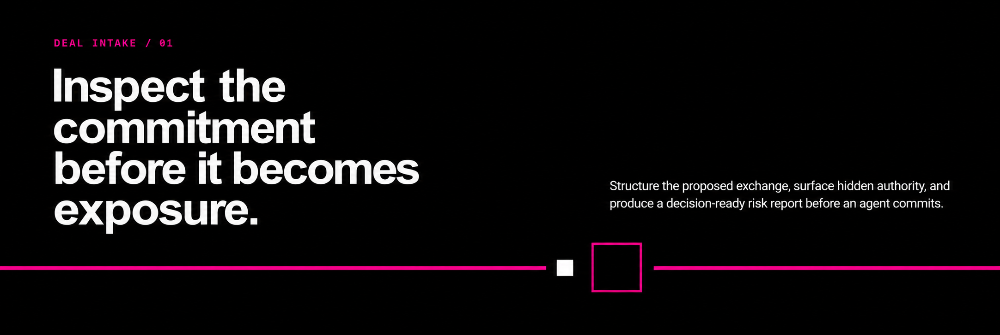
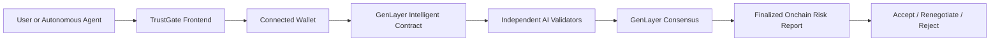

# TrustGate

### Before an Agent Says Yes.

**TrustGate is a pre-commitment risk layer for autonomous agent transactions, powered by GenLayer.**

Autonomous agents can execute transactions, provision infrastructure, move capital, grant permissions, purchase services, and accept contractual terms.

But successful execution does not mean the underlying commitment was safe.

TrustGate evaluates the complete deal **before commitment** and uses GenLayer AI validator consensus to produce a structured onchain Risk Report.

The goal is simple:

> **Give autonomous agents a judgment layer before they say yes.**

### Live Demo

**https://trustgatecheck.xyz**

### GenLayer Studionet Contract

`0x4acc7623a1a5255b717752601F78D2cf3a99e7F3`

[Project Thesis](https://x.com/eam__sha/status/2094519952233398337)

---



---

## Why TrustGate Exists

Agent-to-agent agreements are rarely just one deterministic transaction.

A normal-looking request can contain several interacting commitments:

- spending authority
- contractual obligations
- credential access
- delegated permissions
- cancellation conditions
- variable fees
- evidence requirements
- data disclosure
- third-party authority
- long-lived commitments
- operational instructions

A blockchain can prove that an action happened.

It cannot, through deterministic execution alone, reliably answer questions such as:

- Is the authority proportional to the task?
- Is the evidence good enough to justify execution?
- Can several individually reasonable clauses create unsafe cumulative exposure?
- Does the buyer actually retain meaningful control?
- Can an agent accept materially different terms without fresh approval?
- Does a cancellation clause really stop future financial exposure?

These questions require judgment over meaning, context, evidence, and consequence.

That is the layer TrustGate adds.

---

## How It Works

Every inspection evaluates a complete six-part deal package:

1. **Task**
2. **Contract Terms**
3. **Requested Permissions**
4. **Payment Conditions**
5. **Evidence Requirements**
6. **Instructions / Attached Content**

The complete package is submitted through the user's connected wallet to a deployed GenLayer Intelligent Contract.

Independent GenLayer validators evaluate the proposed commitment.

After consensus and finalization, TrustGate retrieves the report associated with that exact inspection.

The user or autonomous agent then receives a decision-support layer before committing.

### Commitment Gate

TrustGate exposes three explicit outcomes:

**ACCEPT**

Proceed with the current commitment.

**RENEGOTIATE**

Generate safer proposed terms and submit the revised package for a fresh inspection.

**REJECT**

Do not proceed with the current commitment.

TrustGate never silently accepts a deal on behalf of the user.

---

## Architecture



The frontend does not assign predetermined results based on scenario labels.

Every submitted package, including Custom Deals, uses the same deployed Intelligent Contract and validator-consensus path.

---

## Risk Report

A finalized TrustGate report can include:

- **Overall Risk**
- **Executive Summary**
- **Detected Issues**
- **Supporting Evidence**
- **Potential Consequences**
- **Confidence and Unknowns**
- **Recommended Actions**
- **Safer Constraints**
- **Recommended Decision**

Each detected issue is evaluated in the context of the complete deal.

TrustGate is designed to identify both direct risks and interactions between different fields.

For example, a per-transaction spending limit may look safe in isolation while still creating significant exposure if an autonomous agent can execute an unlimited number of transactions without an aggregate cap.

That cross-field reasoning is central to TrustGate.

---

## Why GenLayer

TrustGate depends on decisions that cannot be reduced to simple deterministic rules.

Consider questions like:

- Is this permission necessary for the stated task?
- Is this evidence sufficiently independent?
- Does this payment model create hidden cumulative exposure?
- Is this cancellation mechanism meaningful?
- Does this contract create an irreversible commitment?
- Are revised terms materially safer than the original deal?

These are judgment problems.

GenLayer allows an Intelligent Contract to combine deterministic blockchain state with nondeterministic AI reasoning.

Multiple validators independently evaluate the result before consensus is reached.

TrustGate uses this infrastructure to turn subjective pre-commitment analysis into a finalized onchain decision artifact.

---

## Renegotiation

Risk detection is only the first step.

When a deal can potentially be improved, the user can choose **Renegotiate**.

TrustGate creates a **Counterproposal** containing safer proposed terms.

A Counterproposal is never automatically accepted.

The flow is explicit:

1. TrustGate generates safer proposed terms.
2. The terms are loaded into the editable deal.
3. The user can review or modify them.
4. The revised deal must be explicitly submitted again.
5. GenLayer independently evaluates the revision.
6. TrustGate compares the new result with the previous inspection.

This prevents a suggested revision from silently becoming an accepted commitment.

---

## Revision Intelligence

TrustGate maintains inspection lineage between an original deal and its revisions.

Previous material issues can be classified as:

- **RESOLVED**
- **PARTIALLY RESOLVED**
- **UNRESOLVED**

A revised deal can also introduce:

- **NEW MATERIAL** issues

The revision view can show:

- previous risk
- current risk
- risk direction
- issue-by-issue resolution state
- current evidence

The system therefore asks more than:

> Did the text change?

It asks:

> Did the commitment actually become safer?

---

## Onchain Inspection Lifecycle

A TrustGate inspection follows the real GenLayer transaction lifecycle.

1. TrustGate creates a unique inspection ID.
2. The connected wallet submits the inspection.
3. The frontend preserves the EVM submission hash.
4. TrustGate resolves the corresponding GenLayer transaction ID.
5. AI validators evaluate the proposed deal.
6. Consensus and finalization occur on GenLayer.
7. TrustGate automatically retrieves the finalized report.
8. The frontend verifies that the report belongs to the current inspection before rendering it.

The lifecycle UI reflects confirmed transaction milestones rather than simulated progress.

---

## Scenario System

TrustGate ships with **72 complete curated deal packages**.

### Safe Deal

24 packages with deliberately bounded authority, payments, evidence, and commitments.

### Permission Trap

24 commercially plausible tasks where the requested authority or access can exceed what the task actually requires.

### Multi-Risk Deal

24 complex packages combining contractual, financial, access, permission, evidence, delegation, and operational risk.

### Custom Deal

Users can manually author all six fields and submit the resulting package through the same GenLayer inspection flow.

Scenario labels are starting points only.

They do not hardcode:

- overall risk
- issue count
- detected issues
- recommendation
- Counterproposal
- revision outcome

The current package is evaluated independently by the Intelligent Contract.

---

## Risk Domains

TrustGate can reason across several classes of commitment risk.

### Financial

- missing aggregate spending limits
- repeated sub-threshold transactions
- variable fees outside approval boundaries
- automatic debits
- uncapped cumulative exposure

### Authority

- excessive permissions
- credential creation
- account creation
- delegated authority
- weak revocation controls

### Contractual

- automatic renewal
- automatic conversion
- weak cancellation rights
- post-cancellation obligations
- unilateral modification
- silence treated as acceptance

### Evidence

- provider-controlled evidence
- delayed access to raw records
- insufficient independent verification
- short dispute windows
- weak auditability

### Data and Third Parties

- broad external disclosure
- subcontractor access
- provider substitution
- unclear data-sharing boundaries

The system evaluates these risks as part of one commitment rather than as isolated keywords.

---

## Intelligent Contract

**Network:** GenLayer Studionet

**Contract address:**

`0x4acc7623a1a5255b717752601F78D2cf3a99e7F3`

**Source:**

`contracts/trustgate.py`

Core capabilities include:

- `inspect_deal`
- `inspect_revision`
- inspection-specific report retrieval
- persistent report storage
- AI validator-backed risk evaluation
- revision lineage
- Counterproposal generation

Both curated scenarios and Custom Deals use the same deployed contract.

---

## Wallet Integration

TrustGate supports compatible injected EVM wallets using EIP-1193 and EIP-6963 discovery.

The current application supports wallet flows including:

- MetaMask
- Rabby

The selected wallet is used for:

- GenLayer Studionet network handling
- transaction submission
- EVM receipt resolution
- GenLayer transaction tracking

A wallet connection establishes the session but does not automatically submit a deal.

---

## Studionet Faucet

The live hackathon application includes an integrated GenLayer Studionet faucet.

It allows users to request test GEN required for onchain inspections without leaving TrustGate.

The faucet is a demo convenience for Studionet and is not presented as a production token-distribution system.

---

## Tech Stack

| Layer | Technology |
| --- | --- |
| Judgment Layer | GenLayer |
| Intelligent Contract | Python |
| Network | GenLayer Studionet |
| Validator Layer | GenLayer AI Validator Consensus |
| Frontend | Next.js |
| UI | React + TypeScript |
| GenLayer Integration | genlayer-js |
| Wallet Discovery | EIP-1193 / EIP-6963 |
| Deployment | Cloudflare Workers |

---

## Local Development

Requirements:

- Node.js
- npm
- compatible browser wallet

Install dependencies:

```bash
npm install
```

Start the development server:

```bash
npm run dev
```

Open the local URL printed by Next.js in the terminal.

Run project checks with:

```bash
npm run lint
npm run build
```

The Studionet faucet requires server-side credentials that are intentionally not stored in source control.

---

## Demo Flow

A typical judge or user can test TrustGate in a few steps:

1. Open the live application.
2. Connect a supported wallet.
3. Switch to GenLayer Studionet when prompted.
4. Request test GEN if required.
5. Select a curated scenario or Custom Deal.
6. Review or edit all six commitment fields.
7. Click **Inspect Before Commitment**.
8. Confirm the wallet transaction.
9. Follow the live GenLayer inspection lifecycle.
10. Review the finalized Risk Report.
11. Choose Accept, Renegotiate, or Reject.
12. If renegotiating, review the Counterproposal and explicitly inspect the revision.

---

## What TrustGate Is Not

TrustGate is not a transaction simulator.

It is not primarily trying to predict whether execution will succeed.

A transaction can execute exactly as intended while still representing a dangerous agreement.

The problem may exist in:

- the authority granted
- the payment structure
- the evidence standard
- the cancellation mechanism
- the duration of the commitment
- the ability to change terms
- the interaction between several clauses

TrustGate focuses on the point between:

**An agent received a deal.**

and

**The agent committed to it.**

That is where pre-commitment judgment matters.

---

## Current Scope

TrustGate is a working hackathon MVP on GenLayer Studionet.

Implemented today:

- deployed GenLayer Intelligent Contract
- wallet-submitted onchain inspections
- GenLayer AI validator evaluation
- consensus and finalization tracking
- structured finalized Risk Reports
- Accept / Renegotiate / Reject commitment flow
- Counterproposal generation
- explicit revision re-inspection
- issue-resolution lineage
- 72 curated scenarios
- manually authored Custom Deals
- multi-wallet discovery
- integrated Studionet faucet
- live Cloudflare deployment

TrustGate does not claim production security readiness or completion of a formal security audit.

---

## Roadmap

Potential next steps include:

- persistent inspection history
- organizational risk policies
- configurable agent permission profiles
- richer evidence sources
- automated adversarial testing
- formal security review
- integration with autonomous-agent frameworks
- richer revision comparison
- post-commitment monitoring
- interoperability with post-dispute adjudication systems

TrustGate currently focuses on **pre-commitment judgment**.

Post-dispute adjudication remains a separate future layer.

---

## TrustGate

### Before an Agent Says Yes.

**A safety gate between receiving a deal and committing to it.**
